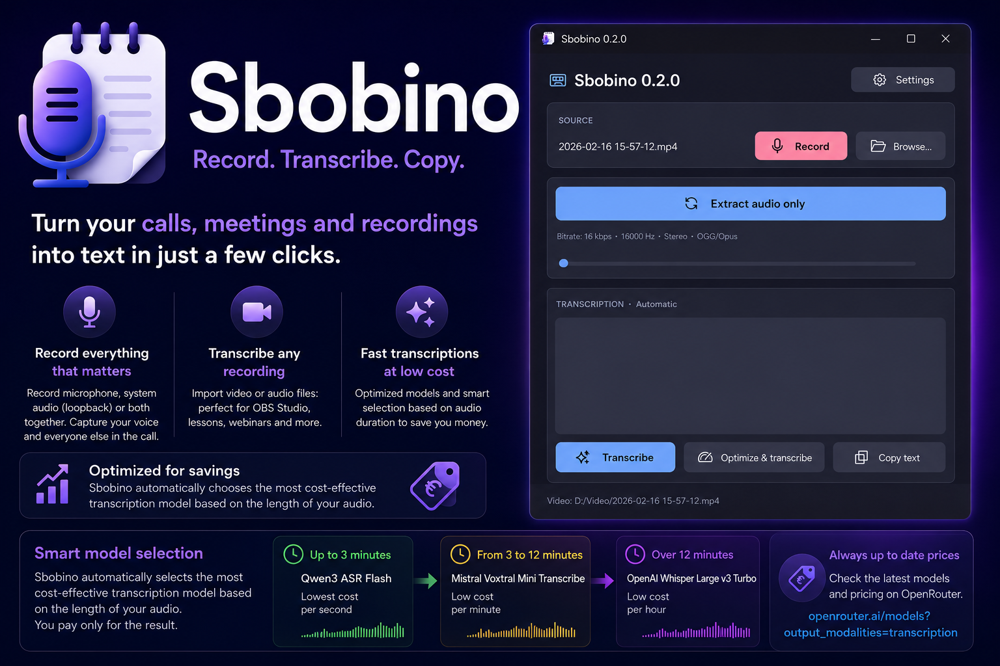

# Sbobino

<p align="center">
  
</p>

Sbobino is a desktop app for Windows designed to record and transcribe calls, lessons, webinars, videos, and audio content without having to use complex command-line tools.

Its main strength is the built-in recorder: you can record only the microphone, only the computer audio via loopback, or both together. This way, during a call, you can capture both your voice and the voices of the other people and get a single transcription, ready to copy.

Sbobino can also work with existing files, such as a recording made with OBS Studio, a saved video, a recorded lesson, or an audio file. The app extracts and prepares the audio, sends it to OpenRouter, and returns the transcribed text.

## Features

- Records calls and meetings by capturing microphone and system audio together.
- Supports three recording modes: microphone, loopback, microphone + loopback.
- Transcribes videos and existing recordings, including those created with OBS Studio.
- Automatically extracts audio from videos.
- Converts audio into a format suitable for transcription.
- Optimizes audio by removing silences and speeding up speech.
- Automatically splits large audio files before upload.
- Allows automatic or manual selection of the OpenRouter transcription model.
- Displays the transcription inside the app and lets you copy it to the clipboard.
- Checks for new versions from the public release repository.

## Requirements

To use Sbobino, you need:

- Windows;
- an active internet connection;
- an OpenRouter account;
- a personal OpenRouter API key;
- `ffmpeg`, required to extract and convert audio;
- correctly configured audio devices, if you want to record microphone or system audio.

OpenRouter supports dedicated APIs for audio transcription through speech-to-text endpoints.

## Low-cost transcriptions

One of Sbobino’s goals is to make transcription accessible even for frequent or long recordings. The models supported by OpenRouter have very low costs, and the app is designed to automatically choose the most cost-effective one based on the audio duration.

This means that a short voice note, a call lasting a few minutes, and a long recording are not handled in the same way: Sbobino selects the most suitable model to reduce the overall transcription cost.

As a guideline, automatic selection may work like this:

- short audio: **Qwen3 ASR Flash**;
- medium-length audio: **Mistral Voxtral Mini Transcribe**;
- long audio: **OpenAI Whisper Large v3 Turbo**.

Actual costs depend on OpenRouter’s updated pricing and on the models available at the time of use. To check updated prices, providers, and models, refer to the official page:

[Available transcription models on OpenRouter](https://openrouter.ai/models?output_modalities=transcription)

## Installation

### 1. Download Sbobino

1. Go to the project’s releases page.
2. Download the latest available version.
3. Extract the `.zip` file into a folder of your choice.
4. Run `Sbobino.exe`.

Sbobino is portable: it does not require a traditional installation.

### 2. Install ffmpeg

Sbobino uses `ffmpeg` to extract audio from videos and prepare it for transcription.

You can configure it in one of these two ways:

#### Option A: ffmpeg in the Sbobino folder

1. Download a Windows build of `ffmpeg`.
2. Extract the downloaded archive.
3. Find the `ffmpeg.exe` file.
4. Copy `ffmpeg.exe` into the same folder as `Sbobino.exe`.

This is the simplest option if you want to keep everything in the same folder.

#### Option B: ffmpeg in the Windows PATH

1. Download and extract `ffmpeg`.
2. Copy the path of the folder containing `ffmpeg.exe`.
3. Add that path to the Windows environment variables under `Path`.
4. Restart Sbobino.

To check that `ffmpeg` is available, you can open Command Prompt and type:

```bash
ffmpeg -version
```

If the installed version appears, `ffmpeg` is configured correctly.

## Usage

### Recording a call

1. Open Sbobino.

2. Choose the recording mode:
   - microphone;
   - system audio;
   - microphone + system audio.

3. Start recording before or during the call.

4. Stop recording when you are done.

5. Start the transcription.

6. Copy the resulting text.

This mode is useful for online meetings, streaming lessons, webinars, and conversations where you want to record both your voice and the voices of the other participants.

### Transcribing an already recorded video

You can also use Sbobino with files created by OBS Studio or other recording programs.

```text
1. Record a video with OBS Studio
2. Open Sbobino
3. Select the video file
4. Sbobino automatically extracts the audio
5. The audio is prepared for transcription
6. The transcription is shown inside the app
```

## Disclaimer

Sbobino is a technical tool for recording, converting, and transcribing audio or video content. The user is solely responsible for how they use it.

Before recording, transcribing, or uploading content to external services, make sure you have the right to do so. In particular, you must verify that:

- the people involved have been informed and, where necessary, have authorized the recording;
- the content does not violate third-party rights, including copyright, related rights, confidentiality, professional secrecy, or contractual obligations;
- the use of the recording and transcription complies with applicable laws on privacy, personal data protection, and copyright;
- any platforms, services, or recorded content allow this type of use.

The project author is not responsible for improper, unauthorized, or unlawful use of the application. Sbobino does not bypass technical protections, does not grant rights over the processed content, and does not replace a legal assessment of the use of recordings.
